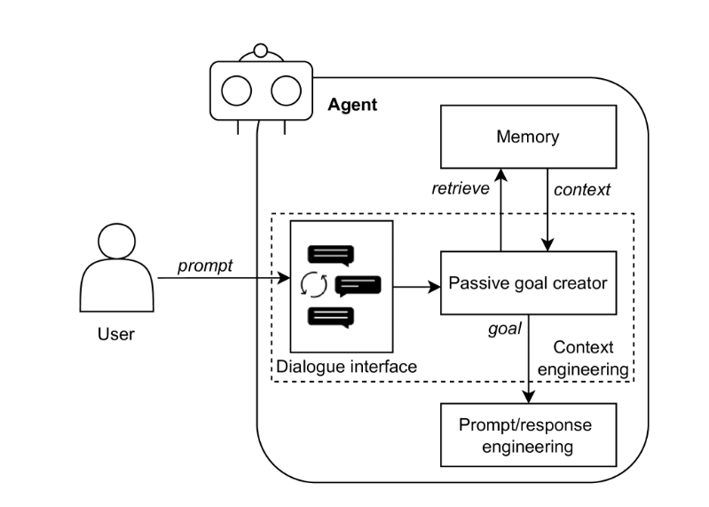

# Agent Design Patterns

Liu et al. (2024) present a systematic framework for foundation model-based agents, addressing core challenges in autonomous decision-making and plan generation ([arXiv:2405.10467](https://arxiv.org/abs/2405.10467)).

## Architectural Components

### 1. Goal Formation

- **Passive Goal Creation**  
  Direct extraction of user-specified objectives (e.g., order-taking systems)
  
- **Proactive Goal Creation**  
  Context-aware goal suggestion using environmental signals (e.g., fatigue detection in smart vehicles)

### 2. Input/Output Processing
- **Prompt/Response Optimization**  
  Standardizes unstructured input and ensures coherent output formatting

### 3. Knowledge Management
- **Retrieval Augmented Generation (RAG)**  
  Integrates real-time external data with internal knowledge repositories

### 4. Planning Systems
- **One-Shot Planning**  
  Complete plan generation in single inference (e.g., route mapping)
- **Incremental Planning**  
  Stepwise refinement with continuous validation (e.g., recipe execution)
- **Multi-Path Planning**  
  Parallel plan generation with optimal path selection

### 5. Validation Mechanisms
- **Self-Refinement**  
  Internal consistency checking and error correction
- **Cross-Agent Validation**  
  Distributed verification through model ensembles
- **Human-in-the-Loop**  
  Expert feedback integration for preference alignment

### 6. Collaborative Architectures
- **Consensus Voting**  
  Democratic resolution through agent polling
- **Role Specialization**  
  Task-oriented agent team composition
- **Debate Protocols**  
  Perspective negotiation through structured discourse

### 7. Safety Systems
- **Multimodal Filtering**  
  Cross-modal content safety enforcement
- **Tool Integration Layer**  
  Unified interface for external service orchestration
- **Performance Monitoring**  
  Continuous agent capability assessment

